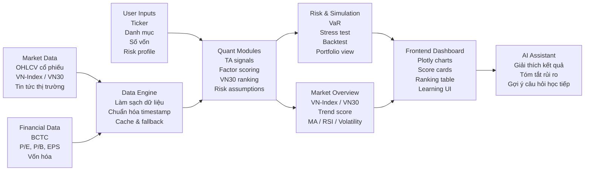
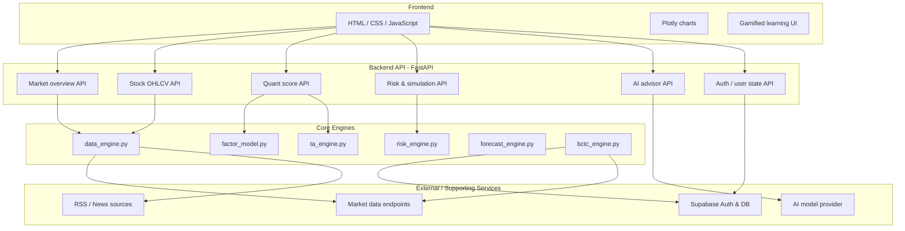
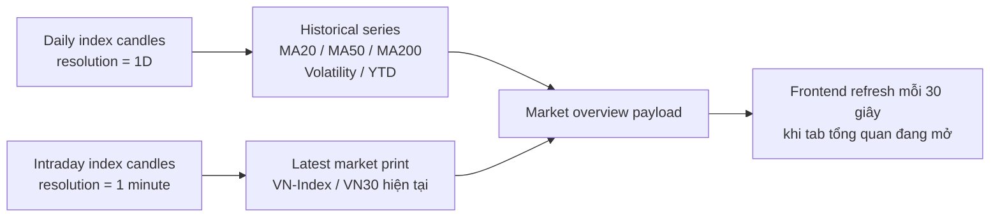

# DORY - Quant & AI Architecture

> DORY là dashboard học và thực hành đầu tư định lượng cho thị trường chứng khoán Việt Nam.
> Mục tiêu của dự án là giúp người mới đọc dữ liệu thị trường có hệ thống hơn, đồng thời tạo một nền tảng để thử nghiệm các ý tưởng quant, risk và AI explanation.

## Đọc Nhanh

DORY không được thiết kế để "phím hàng" hoặc dự đoán chắc thắng. Dự án tập trung vào 4 việc:

1. Thu thập và chuẩn hóa dữ liệu thị trường Việt Nam.
2. Tính các tín hiệu định lượng cơ bản như momentum, valuation proxy, sức khỏe tài chính và rủi ro.
3. Biến kết quả phân tích thành dashboard dễ đọc cho người mới.
4. Dùng AI assistant để giải thích lại insight, giả định và rủi ro bằng ngôn ngữ dễ hiểu hơn.

## Pipeline Tổng Quan

## Cấu Trúc Hệ Thống

## Luồng Phân Tích

| Bước | Module | Vai trò |
|---|---|---|
| 1 | Market overview | Đọc bối cảnh VN-Index/VN30 trước khi chọn từng mã |
| 2 | Stock data | Lấy OHLCV, giá gần nhất và dữ liệu lịch sử của cổ phiếu |
| 3 | Technical analysis | Tính MA, RSI, volatility, trend và các tín hiệu kỹ thuật cơ bản |
| 4 | Fundamental snapshot | Tổng hợp BCTC, định giá và chỉ số tài chính quan trọng |
| 5 | Quant scoring | Chấm điểm theo momentum, value và financial health |
| 6 | Risk simulation | Ước lượng VaR, stress test, backtest và rủi ro danh mục |
| 7 | AI explanation | Giải thích kết quả theo ngôn ngữ dễ hiểu, không thay thế quyết định đầu tư |

## Market Overview Realtime Logic

Daily index data có thể bị trễ trong phiên, nên DORY dùng cách ghép dữ liệu:

Cách này giữ các chỉ báo dài hạn ổn định, nhưng vẫn cho phép giá VN-Index/VN30 trên dashboard phản ánh dữ liệu trong phiên.

## Các Thành Phần Chính

### 1. Market Dashboard

- Theo dõi VN-Index và VN30 trước khi phân tích từng cổ phiếu.
- Hiển thị trend score, MA20/50/200, RSI, volatility và drawdown.
- Giúp người mới tránh nhìn một mã cổ phiếu mà bỏ qua bối cảnh thị trường.

### 2. Stock Analysis

- Xem dữ liệu giá, kỹ thuật, BCTC và tin tức của từng mã.
- Tách các nhóm thông tin để người dùng hiểu vì sao một mã có điểm cao/thấp.

### 3. VN30 Ranking

- Chấm điểm các mã VN30 theo một số nhóm yếu tố định lượng.
- Mục tiêu là hỗ trợ học tư duy ranking, không phải tạo danh sách mua/bán tuyệt đối.

### 4. Risk & Simulation

- Mô phỏng rủi ro danh mục với VaR và stress test.
- Cho người dùng thấy cùng một kỳ vọng lợi nhuận có thể đi kèm mức drawdown khác nhau.

### 5. AI Assistant

- Tóm tắt dashboard bằng ngôn ngữ dễ hiểu.
- Giải thích ý nghĩa của chỉ số, rủi ro và giả định.
- Hướng người mới đặt câu hỏi tốt hơn thay vì chỉ nhìn một con số.

## Nguyên Tắc Thiết Kế

- **Educational first:** ưu tiên học và hiểu dữ liệu hơn là ra tín hiệu mua bán.
- **Quant but readable:** có logic định lượng nhưng giao diện phải đủ dễ hiểu cho người mới.
- **Assumption-aware:** mô hình phải thể hiện giả định, rủi ro và giới hạn.
- **Vietnam-market focused:** ưu tiên dữ liệu, ngôn ngữ và workflow phù hợp thị trường Việt Nam.
- **No guaranteed prediction:** không trình bày kết quả như dự báo chắc chắn.

## Giới Hạn Hiện Tại

- Chưa phải trading bot tự động.
- Chưa thay thế phân tích chuyên nghiệp hoặc tư vấn tài chính.
- Chất lượng kết quả phụ thuộc vào độ đầy đủ và độ trễ của nguồn dữ liệu.
- Một số mô hình scoring vẫn ở mức học thuật/thực nghiệm, cần thêm kiểm định ngoài mẫu.
- Backtest cần tiếp tục được kiểm tra kỹ để tránh overfitting và look-ahead bias.

## Roadmap Gợi Ý

1. Thêm kiểm định factor ngoài mẫu cho thị trường Việt Nam.
2. Bổ sung giải thích chi tiết hơn cho từng điểm số trong VN30 ranking.
3. Mở rộng dữ liệu intraday và lịch sử điều chỉnh giá.
4. Cải thiện portfolio optimizer và risk attribution.
5. Thêm benchmark rõ ràng giữa chiến lược, VN30 và VN-Index.
6. Tạo chế độ học cho người mới: từ chỉ số cơ bản đến factor investing.

## Disclaimer

DORY là công cụ học tập và nghiên cứu dữ liệu. Nội dung trong dashboard chỉ mang tính tham khảo, không phải khuyến nghị đầu tư, không đảm bảo lợi nhuận và không thay thế tư vấn tài chính độc lập.
